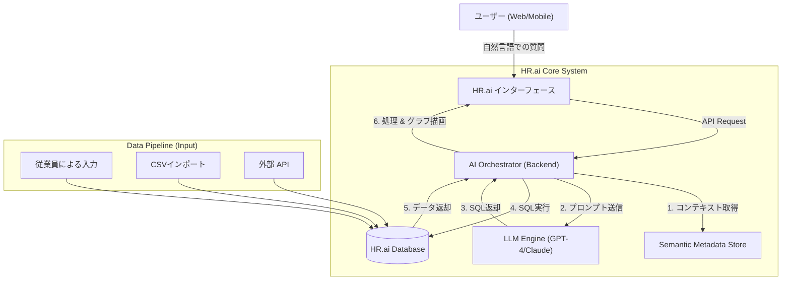

# **CONCEPT DOCUMENT: HR.ai INTEGRATION**

**インテリジェントな人事データ管理・分析ソリューション**

## **1. 概要 (Executive Summary)**

### **1.1. 背景**

**HR.ai** は現在、会社の工数管理（Workforce Management）を行うバックボーンシステムであり、多様なソース（従業員による入力、リーダーからのCSVインポート、他部署からのAPI連携）からの勤怠データを保存・管理しています。本システムは、正社員、臨時社員（パートタイム）、外国人スタッフなど、多様な対象者を管理しています。

### **1.2. 課題 (Pain Points)**

データは集約されていますが、その活用には多くの障壁があります：

*   **Outdated Reports (レポートの陳腐化):** 部署やプロジェクトごとにレポートのニーズは絶えず変化しますが、現在のダッシュボードはハードコーディングされており、柔軟性がありません。
*   **High Maintenance (高い保守コスト):** 要件変更のたびに、ITチームが新しいクエリやレポート画面を更新するために多大なリソースを費やしています。
*   **Passive Data (受動的なデータ):** データはデータベースに保存されているだけで、即時の意思決定支援には活用されていません。

### **1.3. 提案するソリューション (The Solution)**

**Large Language Model (LLM)** を HR.ai に統合し、モデルを **「静的レポーティング (Static Reporting)」** から **「対話型分析 (Conversational Analytics)」** へと転換します。

*   ユーザーは自然言語で質問します。
*   AIがコンテキストを理解し、SQLを自動生成してデータを抽出します。
*   システムが自動的にグラフを描画し、リアルタイムレポートを作成します。

## **2. システムアーキテクチャ (System Architecture)**

HR.ai システムは、構造化データ（Structured Data）に特化した **Retrieval-Augmented Generation (RAG)** モデルに基づいて動作します。

### **2.1. ブロック図 (High-Level Diagram)**

### **2.2. 主要コンポーネント**

1.  **Semantic Layer (意味論的レイヤー):**
    *   LLMに生のDB構造への直接アクセスを許可しません。
    *   テーブルの意味を記述するメタデータを保持します：work_logs（勤怠）、employees（人事）。
    *   ロジックを定義します：「フルタイム」= 8h、「有効データ」= status Approved。
2.  **Input Pipeline (データ入力パイプライン):**
    *   3つのソース（Manual, CSV, API）からのデータが、work_logsテーブル内で同じフォーマットに正規化され、ソース元を追跡するための `source_type` カラムを持つことを保証します。
3.  **Visualization Engine (可視化エンジン):**
    *   AIからのJSONデータを受け取り、適切なグラフタイプ（比較には棒グラフ、トレンドには折れ線グラフなど）を自動選択するフロントエンドモジュールです。

## **3. 主なユースケース (Key Scenarios)**

### **Use Case 1: 運用監視 (Operational Monitoring)**

*   **Actor:** 部門リーダー (Department Leader).
*   **ニーズ:** 給与締め日前に、勤怠入力忘れや労働時間不足の従業員をチェックしたい。
*   **Prompt:** *「今週の労働時間が40時間未満のTechチームの従業員をリストアップしてください。休暇中の人は除外して。」*
*   **Output:** ステータス付きのリスト形式（Table）で表示し、時間の不足している人を赤色で強調表示します。

### **Use Case 2: コスト & パフォーマンス分析 (Analytics)**

*   **Actor:** 取締役 / HRマネージャー.
*   **ニーズ:** 各ソース（採用源など）間の人材活用効率を比較したい。
*   **Prompt:** *「今四半期の正社員と臨時社員の総労働時間を比較するグラフを描画してください。どのデータソースが最も多くの時間を占めていますか？」*
*   **Output:**
    *   正社員/臨時社員の比率を示す円グラフ (Pie Chart)。
    *   ソース別（Import CSV vs API vs Manual）の積み上げ棒グラフ (Stacked Bar)。

### **Use Case 3: アドホックレポート (Ad-hoc Reporting)**

*   **Actor:** 経理部 / パートナー.
*   **ニーズ:** 海外支店への支払いのために具体的な数値が必要。
*   **Prompt:** *「10月における、従業員コードが 'OS_JP' (Onsite Japan) で始まる従業員の総労働時間を、プロジェクトごとにグループ化してレポート出力してください。」*
*   **Output:** システムは結果テーブルを表示し、即座に **「Download Excel」** ボタンを提供します。

## **4. 提供価値 (Value Proposition)**

| 要素 | AI導入前 | HR.ai 導入後 |
| :---- | :---- | :---- |
| **レポート作成時間** | 3-5日 (ITへ依頼 -> コード作成 -> デプロイ) | < 30秒 (質問入力 -> 結果表示) |
| **カスタマイズ性** | 低い。既存の画面しか閲覧できない。 | 無限。ユーザーが言葉でレポートを「描く」ことができる。 |
| **保守性** | コスト高。ロジック変更時にコード修正が必要。 | 簡単。メタデータファイルを更新するだけ。 |
| **ユーザー体験** | 多段階の操作、複雑なフィルタリング/検索。 | 直感的、自然な対話形式。 |

## **5. 開発ロードマップ (Roadmap)**

*   **Phase 1: HR.ai Insight (MVP)**
    *   基本的な Text-to-SQL の統合。
    *   数値テーブル形式（Table View）でのQ&Aサポート。
    *   Admin/HRマネージャーのみに利用を制限。
*   **Phase 2: Visual Intelligence**
    *   グラフ（Charts）の自動生成。
    *   AI結果からのExcel/PDFエクスポート対応。
    *   各部門リーダーへの展開。
*   **Phase 3: Proactive Assistant**
    *   異常検知（Anomaly Detection）：「チームAで労働時間の急増を検知しました」。
    *   トレンド予測（Forecasting）。

---
**次へ:** [システム設計を見る (System Design)](./02_HR_ai_System_Design.md)

*本文書の著作権は HR.ai プロジェクトに帰属します。*
