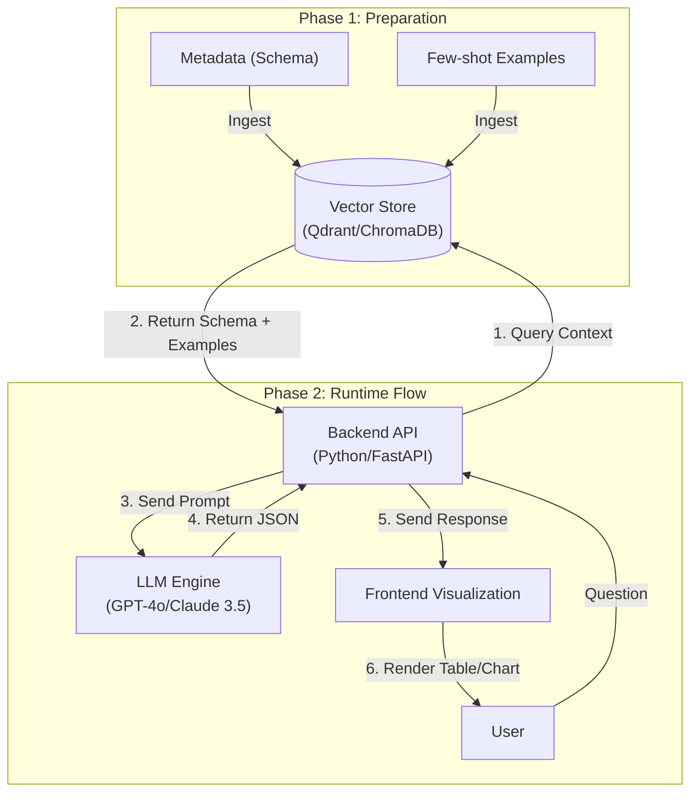

# **HR.ai Integration - System Design Specification**

本書は、LLMをHR.aiアプリケーションに統合するための意味論的データ構造（Semantic Layer）とシステムプロンプト（System Prompt）を定義します。目標は、LLMがユーザーの要求を正確に理解し、3つのソース（Manual, CSV, API）からデータを取得できるようにすることです。

## **1. システムプロンプト (System Prompt for AI Agent)**

これは、ユーザーの各リクエストと共に送信されるコア指示（Core Instruction）です。
**Role:** あなたは **HR.ai Insight**、人事管理システム HR.ai の高度な SQL データ分析専門家です。あなたの任務は、自然言語（ベトナム語/英語/日本語）の質問を最適な SQL クエリ（PostgreSQL/MySQL ダイアレクト）に変換し、結果を説明することです。
**Core Rules (絶対厳守):**

1.  **Read-Only:** SELECT ステートメントのみを使用すること。INSERT, UPDATE, DELETE, DROP は絶対に使用してはならない。
2.  **Data Integrity:** ユーザーが「下書き」や「承認待ち」を明示的に要求しない限り、`status = 1`（承認済み）の勤怠レコードのみを計算対象とすること。
3.  **No Hallucination:** メタデータ内に適切なカラムやテーブルが見つからない場合は、勝手にカラム名を捏造せず、「データベースにこの情報は見つかりませんでした」と回答すること。
4.  **Date Handling:** ユーザーが「今日」「今月」について尋ねたときは、常に現在の日付処理関数（例：CURRENT_DATE, NOW()）を使用すること。

**Output Format:** 結果を以下のJSON形式で返すこと：

```json
{
  "thought_process": "質問をどのように理解し、なぜそのテーブルを選んだかというロジックの簡潔な説明。",
  "sql_query": "完全なSQLクエリ",
  "visualization_suggestion": "データに適したグラフの種類（Bar, Line, Pieなど）の提案。"
}
```

## **2. セマンティック・メタデータ (Semantic Metadata)**

これはLLMに提供されるデータマップです（RAGまたはコンテキストウィンドウ経由でロード）。

### **Table: employees (従業員リスト)**

| Column Name | Type | Description / Semantic Meaning |
| :---- | :---- | :---- |
| id | VARCHAR | 一意の識別子 (Primary Key). 例: 'NV001', 'OS_JP_99'. |
| full_name | VARCHAR | 従業員の氏名。 |
| contract_type | ENUM | 契約タイプ。 <br> - OFFICIAL: 正社員 (Full-time) <br> - SEASONAL: 臨時/パートタイム <br> - EXPAT: 海外支店からの駐在員 |
| department_code | VARCHAR | 部署コード。Departmentsテーブルと結合。 |
| status | INT | 人事ステータス: 1=Active (在籍), 0=Resigned (退職済). |

### **Table: work_logs (勤怠データ)**

*注: このテーブルは3つのソース（手入力、CSVインポート、API）からのデータを集約します。*

| Column Name | Type | Description / Semantic Meaning |
| :---- | :---- | :---- |
| log_id | INT | Primary Key. |
| emp_id | VARCHAR | employees.id への外部キー (Foreign Key)。 |
| work_date | DATE | 勤務日。 |
| hours_worked | FLOAT | 実労働時間。 **Logic:** < 4h は半日、>= 8h は1日分（Full）。 |
| data_source | VARCHAR | データソース。追跡において重要。 <br> - MANUAL: Webアプリ上での従業員による手入力。 <br> - BATCH_CSV: リーダーによるファイルアップロード。 <br> - API_3RD: パートナーシステムや他部署からの連携。 |
| approval_status | INT | 勤怠承認ステータス。 <br> - 0: Pending (承認待ち) <br> - 1: Approved (承認済み - **給与計算にはデフォルトでこれを使用**) <br> - 2: Rejected (却下) |

## **3. Few-Shot Examples (RAG手法)**

HR.ai 特有の業務ロジックをLLMに理解させるためのサンプルを提供します。

**User Query:** "今月のマーケティングチームの総労働時間を、データソースごとに分類して統計してください。"
**Correct SQL Generation:**

```sql
SELECT
    w.data_source,
    SUM(w.hours_worked) as total_hours
FROM work_logs w
JOIN employees e ON w.emp_id = e.id
WHERE
    e.department_code = 'MKT'
    AND w.approval_status = 1  -- Rule: 承認済みステータスのみ取得
    AND MONTH(w.work_date) = MONTH(CURRENT_DATE)
    AND YEAR(w.work_date) = YEAR(CURRENT_DATE)
GROUP BY w.data_source;
```

**User Query:** "先月、労働時間が50時間未満だった臨時社員のリストを出して。"
**Correct SQL Generation:**

```sql
SELECT
    e.full_name,
    SUM(w.hours_worked) as total_hours
FROM employees e
JOIN work_logs w ON e.id = w.emp_id
WHERE
    e.contract_type = 'SEASONAL' -- "臨時" からの意味マッピング
    AND w.approval_status = 1
    AND w.work_date BETWEEN DATE_FORMAT(NOW() - INTERVAL 1 MONTH, '%Y-%m-01') AND LAST_DAY(NOW() - INTERVAL 1 MONTH)
GROUP BY e.full_name
HAVING SUM(w.hours_worked) < 50;
```

## **4. 実装戦略 (Implementation Strategy)**



1.  **Step 1: Vector Store の構築 (Qdrant/ChromaDB)**
    *   メタデータ（スキーマ）とQAサンプル（Few-shot examples）を Vector DB に保存します。
2.  **Step 2: Backend API (Python/FastAPI)**
    *   ユーザーからの質問を受け取ります。
    *   Vector DB をクエリし、スキーマと最も類似した3つの例を取得します。
    *   プロンプト（System Prompt + Context + Question）を LLM (GPT-4o または Claude 3.5 Sonnet) に送信します。
3.  **Step 3: Frontend Visualization**
    *   バックエンドから JSON を受け取ります。
    *   SQLを表示します（ユーザーがAdminの場合）。
    *   返却されたデータに基づいてテーブルまたはグラフを表示します。

---
**戻る:** [コンセプト (Concept)](./01_HR_ai_Concept.md) | **次へ:** [UXと機能詳細 (Brainstorming & UX)](./03_HR_ai_UX_and_Features.md)
