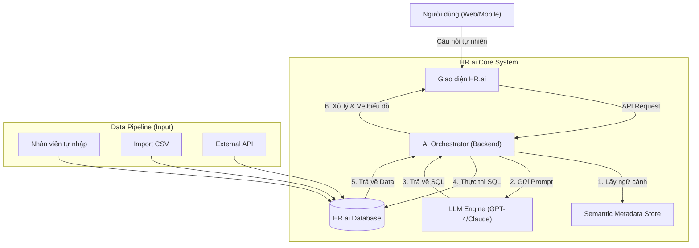

# **CONCEPT DOCUMENT: HR.ai INTEGRATION**

**Giải pháp Quản trị & Phân tích Dữ liệu Nhân sự Thông minh**

## **1. Giới thiệu chung (Executive Summary)**

### **1.1. Bối cảnh**

**HR.ai** hiện là hệ thống backbone quản lý công số (workforce management) của công ty, chịu trách nhiệm lưu trữ dữ liệu chấm công từ đa nguồn (nhân viên nhập, import CSV từ leader, API từ các phòng ban khác). Hệ thống quản lý đa dạng đối tượng: nhân viên chính thức, thời vụ, và nhân sự nước ngoài.

### **1.2. Vấn đề (Pain Points)**

Mặc dù dữ liệu được tập trung, việc khai thác dữ liệu gặp nhiều trở ngại:

* **Outdated Reports:** Nhu cầu báo cáo thay đổi liên tục theo từng phòng ban/dự án, trong khi các màn hình Dashboard hiện tại được code cứng (hard-coded).
* **High Maintenance:** Đội ngũ IT tốn quá nhiều nguồn lực để update các query và màn hình report mới mỗi khi có yêu cầu thay đổi.
* **Passive Data:** Dữ liệu nằm im trong Database, chưa hỗ trợ ra quyết định tức thời.

### **1.3. Giải pháp đề xuất (The Solution)**

Tích hợp **Large Language Model (LLM)** vào HR.ai để chuyển đổi mô hình từ **"Static Reporting"** sang **"Conversational Analytics"**.

* Người dùng hỏi bằng ngôn ngữ tự nhiên.
* AI hiểu ngữ cảnh, tự viết SQL, truy xuất dữ liệu.
* Hệ thống tự động vẽ biểu đồ và tạo báo cáo Real-time.

## **2. Kiến trúc Hệ thống (System Architecture)**

Hệ thống HR.ai hoạt động dựa trên mô hình **Retrieval-Augmented Generation (RAG)** chuyên biệt cho dữ liệu có cấu trúc (Structured Data).

### **2.1. Sơ đồ khối (High-Level Diagram)**

### **2.2. Các thành phần chính**

1. **Semantic Layer (Lớp ngữ nghĩa):**
   * Không cho LLM truy cập trực tiếp cấu trúc DB thô.
   * Chứa Metadata mô tả ý nghĩa các bảng: work_logs (chấm công), employees (nhân sự).
   * Định nghĩa Logic: "Đủ công" = 8h, "Dữ liệu hợp lệ" = status Approved.
2. **Input Pipeline (Luồng dữ liệu vào):**
   * Đảm bảo dữ liệu từ 3 nguồn (Manual, CSV, API) được chuẩn hóa về cùng một format trong bảng work_logs, có cột source_type để truy vết nguồn gốc.
3. **Visualization Engine (Bộ sinh hiển thị):**
   * Module frontend có khả năng nhận dữ liệu JSON từ AI và tự động chọn loại biểu đồ phù hợp (Bar chart cho so sánh, Line chart cho xu hướng).

## **3. Các Use Cases Điển hình (Key Scenarios)**

### **Use Case 1: Giám sát vận hành (Operational Monitoring)**

* **Actor:** Trưởng bộ phận (Department Leader).
* **Nhu cầu:** Kiểm tra xem nhân viên nào quên nhập công hoặc chưa đủ giờ làm trước khi chốt lương.
* **Prompt:** *"Liệt kê những nhân viên team Tech có tổng số giờ làm việc tuần này dưới 40 giờ. Loại trừ những người đang nghỉ phép."*
* **Output:** Một bảng danh sách (Table) kèm trạng thái, tô đỏ những người thiếu nhiều giờ.

### **Use Case 2: Phân tích chi phí & Hiệu suất (Analytics)**

* **Actor:** Giám đốc / HR Manager.
* **Nhu cầu:** So sánh hiệu quả sử dụng nhân sự giữa các nguồn.
* **Prompt:** *"Vẽ biểu đồ so sánh tổng công của nhân viên Chính thức và Thời vụ trong quý này. Nguồn dữ liệu nào đóng góp nhiều giờ nhất?"*
* **Output:**
    * Biểu đồ tròn (Pie Chart) tỷ lệ giữa Chính thức/Thời vụ.
    * Biểu đồ cột chồng (Stacked Bar) phân theo nguồn (Import CSV vs API vs Manual).

### **Use Case 3: Báo cáo tùy chỉnh (Ad-hoc Reporting)**

* **Actor:** Phòng Kế toán / Đối tác.
* **Nhu cầu:** Cần số liệu cụ thể để thanh toán cho chi nhánh nước ngoài.
* **Prompt:** *"Xuất report tổng hợp giờ làm của các nhân viên có mã bắt đầu bằng 'OS_JP' (Onsite Japan) trong tháng 10, nhóm theo dự án."*
* **Output:** Hệ thống hiển thị bảng kết quả và nút **"Download Excel"** ngay lập tức.

## **4. Giá trị mang lại (Value Proposition)**

| Yếu tố | Trước khi có AI | Sau khi có HR.ai |
| :---- | :---- | :---- |
| **Thời gian tạo report** | 3-5 ngày (Gửi request IT -> Code -> Deploy) | < 30 giây (Nhập câu hỏi -> Có kết quả) |
| **Khả năng tùy biến** | Thấp. Chỉ xem được các màn hình có sẵn. | Vô hạn. Người dùng tự "vẽ" report bằng lời nói. |
| **Bảo trì** | Tốn kém. Phải sửa code khi logic thay đổi. | Đơn giản. Chỉ cần cập nhật file Metadata. |
| **Trải nghiệm người dùng** | Thao tác nhiều bước, lọc/search phức tạp. | Trực quan, hội thoại tự nhiên. |

## **5. Lộ trình phát triển (Roadmap)**

* **Phase 1: HR.ai Insight (MVP)**
  * Tích hợp Text-to-SQL cơ bản.
  * Hỗ trợ hỏi đáp dạng bảng số liệu (Table View).
  * Giới hạn cho Admin/HR Manager sử dụng.
* **Phase 2: Visual Intelligence**
  * Tự động sinh biểu đồ (Charts).
  * Hỗ trợ Export ra Excel/PDF từ kết quả AI.
  * Mở rộng cho các Leader bộ phận.
* **Phase 3: Proactive Assistant**
  * Cảnh báo bất thường (Anomaly Detection): "Phát hiện lượng giờ làm tăng đột biến ở team A".
  * Dự báo xu hướng (Forecasting).

---
**Tiếp theo:** [Xem Thiết kế Hệ thống (System Design)](./02_HR_ai_System_Design.md)

*Tài liệu này thuộc bản quyền của dự án HR.ai.*