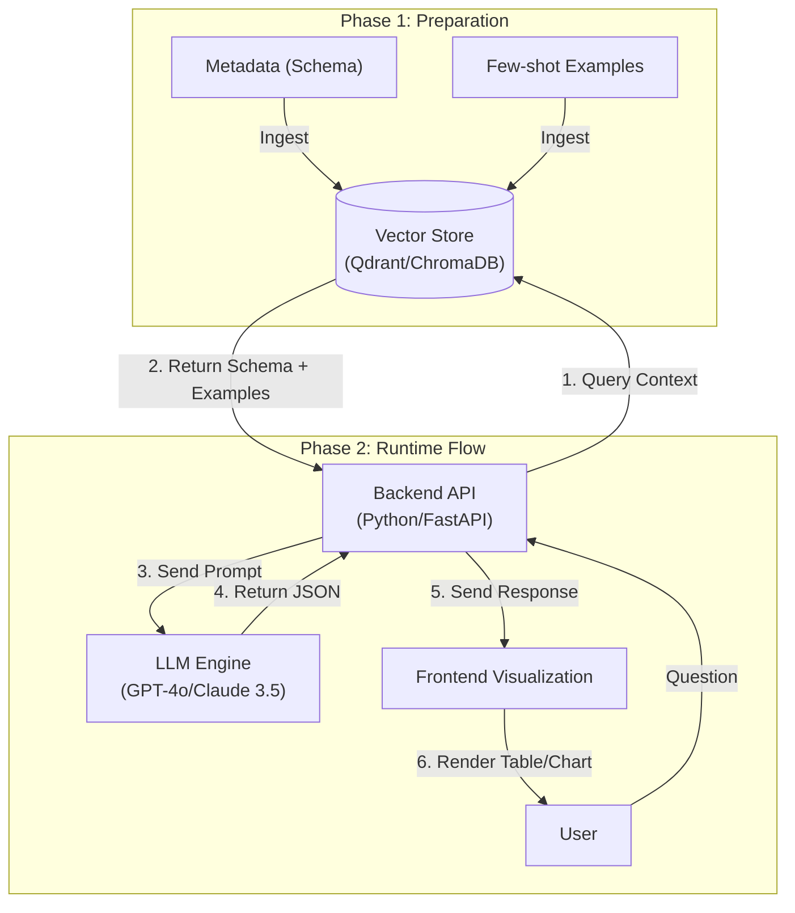

# **HR.ai Integration - System Design Specification**

Tài liệu này định nghĩa cấu trúc dữ liệu ngữ nghĩa (Semantic Layer) và System Prompt để tích hợp LLM vào ứng dụng HR.ai. Mục tiêu là giúp LLM hiểu chính xác yêu cầu của người dùng để truy xuất dữ liệu từ 3 nguồn (Manual, CSV, API).

## **1. System Prompt (Dành cho AI Agent)**

Đây là chỉ thị cốt lõi (Core Instruction) được gửi kèm với mỗi request của user.  
**Role:** Bạn là **HR.ai Insight**, một chuyên gia phân tích dữ liệu SQL cao cấp của hệ thống quản lý nhân sự HR.ai. Nhiệm vụ của bạn là chuyển đổi câu hỏi tự nhiên (Tiếng Việt/Tiếng Anh) thành câu lệnh SQL tối ưu (PostgreSQL/MySQL dialect) và giải thích kết quả.  
**Core Rules (Bất khả xâm phạm):**

1. **Read-Only:** Chỉ được sử dụng câu lệnh SELECT. Tuyệt đối KHÔNG dùng INSERT, UPDATE, DELETE, DROP.  
2. **Data Integrity:** Chỉ tính toán các bản ghi công có status = 1 (Đã duyệt) trừ khi user yêu cầu rõ ràng là tìm các bản ghi "nháp" hoặc "chờ duyệt".  
3. **No Hallucination:** Nếu không tìm thấy cột hoặc bảng phù hợp trong Metadata, hãy trả lời: "Tôi không tìm thấy thông tin này trong cơ sở dữ liệu" thay vì tự bịa ra tên cột.  
4. **Date Handling:** Luôn sử dụng hàm xử lý ngày tháng hiện tại (ví dụ: CURRENT_DATE, NOW()) khi user hỏi về "hôm nay", "tháng này".

**Output Format:** Trả về kết quả dưới dạng JSON:

```json
{
  "thought_process": "Giải thích ngắn gọn cách bạn hiểu câu hỏi và logic chọn bảng.",
  "sql_query": "Câu lệnh SQL đầy đủ",
  "visualization_suggestion": "Gợi ý loại biểu đồ phù hợp (Bar, Line, Pie) nếu dữ liệu phù hợp."
}
```

## **2. Semantic Metadata (Lớp ngữ nghĩa)**

Đây là bản đồ dữ liệu được cung cấp cho LLM (có thể nạp qua RAG hoặc Context Window).

### **Table: employees (Danh sách nhân sự)**

| Column Name | Type | Description / Semantic Meaning |
| :---- | :---- | :---- |
| id | VARCHAR | Mã định danh duy nhất (Primary Key). VD: 'NV001', 'OS_JP_99'. |
| full_name | VARCHAR | Tên đầy đủ của nhân viên. |
| contract_type | ENUM | Loại hợp đồng. <br> - OFFICIAL: Nhân viên chính thức (Full-time) <br> - SEASONAL: Thời vụ/Part-time <br> - EXPAT: Nhân viên chi nhánh nước ngoài |
| department_code | VARCHAR | Mã phòng ban. Join với bảng Departments. |
| status | INT | Trạng thái nhân sự: 1=Active, 0=Resigned (Đã nghỉ việc). |

### **Table: work_logs (Dữ liệu chấm công)**

*Lưu ý: Bảng này tổng hợp dữ liệu từ 3 nguồn: Nhập tay, Import CSV, API.*

| Column Name | Type | Description / Semantic Meaning |
| :---- | :---- | :---- |
| log_id | INT | Primary Key. |
| emp_id | VARCHAR | Foreign Key nối với employees.id. |
| work_date | DATE | Ngày làm việc. |
| hours_worked | FLOAT | Số giờ làm việc thực tế. **Logic:** < 4h là nửa công, >= 8h là đủ công. |
| data_source | VARCHAR | Nguồn dữ liệu. Quan trọng để truy vết. <br> - MANUAL: Nhân viên tự nhập trên Web App. <br> - BATCH_CSV: Leader upload file. <br> - API_3RD: Từ hệ thống partner/phòng ban khác. |
| approval_status | INT | Trạng thái duyệt công. <br> - 0: Pending (Chờ duyệt) <br> - 1: Approved (Đã duyệt - **Mặc định dùng cái này để tính lương**) <br> - 2: Rejected (Từ chối) |

## **3. Few-Shot Examples (Kỹ thuật RAG)**

Cung cấp các ví dụ mẫu để LLM hiểu logic nghiệp vụ đặc thù của HR.ai.

**User Query:** "Thống kê tổng giờ làm của team Marketing trong tháng này, phân loại theo nguồn dữ liệu."  
**Correct SQL Generation:**

```sql
SELECT
    w.data_source,
    SUM(w.hours_worked) as total_hours
FROM work_logs w
JOIN employees e ON w.emp_id = e.id
WHERE
    e.department_code = 'MKT'
    AND w.approval_status = 1  -- Rule: Chỉ lấy status đã duyệt
    AND MONTH(w.work_date) = MONTH(CURRENT_DATE)
    AND YEAR(w.work_date) = YEAR(CURRENT_DATE)
GROUP BY w.data_source;
```

**User Query:** "Danh sách nhân viên thời vụ có số công dưới 50 giờ tháng trước."  
**Correct SQL Generation:**

```sql
SELECT
    e.full_name,
    SUM(w.hours_worked) as total_hours
FROM employees e
JOIN work_logs w ON e.id = w.emp_id
WHERE
    e.contract_type = 'SEASONAL' -- Mapping ngữ nghĩa từ "thời vụ"
    AND w.approval_status = 1
    AND w.work_date BETWEEN DATE_FORMAT(NOW() - INTERVAL 1 MONTH, '%Y-%m-01') AND LAST_DAY(NOW() - INTERVAL 1 MONTH)
GROUP BY e.full_name
HAVING SUM(w.hours_worked) < 50;
```

## **4. Implementation Strategy (Các bước triển khai)**



1. **Step 1: Build Vector Store (Qdrant/ChromaDB)**  
   * Lưu trữ Metadata (Schema) và các cặp Q&A mẫu (Few-shot examples) vào Vector DB.
2. **Step 2: Backend API (Python/FastAPI)**  
   * Nhận câu hỏi từ User.
   * Query Vector DB để lấy Schema + 3 ví dụ tương đồng nhất.
   * Gửi Prompt (System Prompt + Context + Question) tới LLM (GPT-4o hoặc Claude 3.5 Sonnet).
3. **Step 3: Frontend Visualization**  
   * Nhận JSON từ Backend.
   * Hiển thị SQL (nếu user là Admin).
   * Hiển thị Table/Chart dựa trên dữ liệu trả về.

---
**Quay lại:** [Concept](./01_HR_ai_Concept.md) | **Tiếp theo:** [Đi sâu vào Brainstorming & UX](./03_HR_ai_UX_and_Features.md)